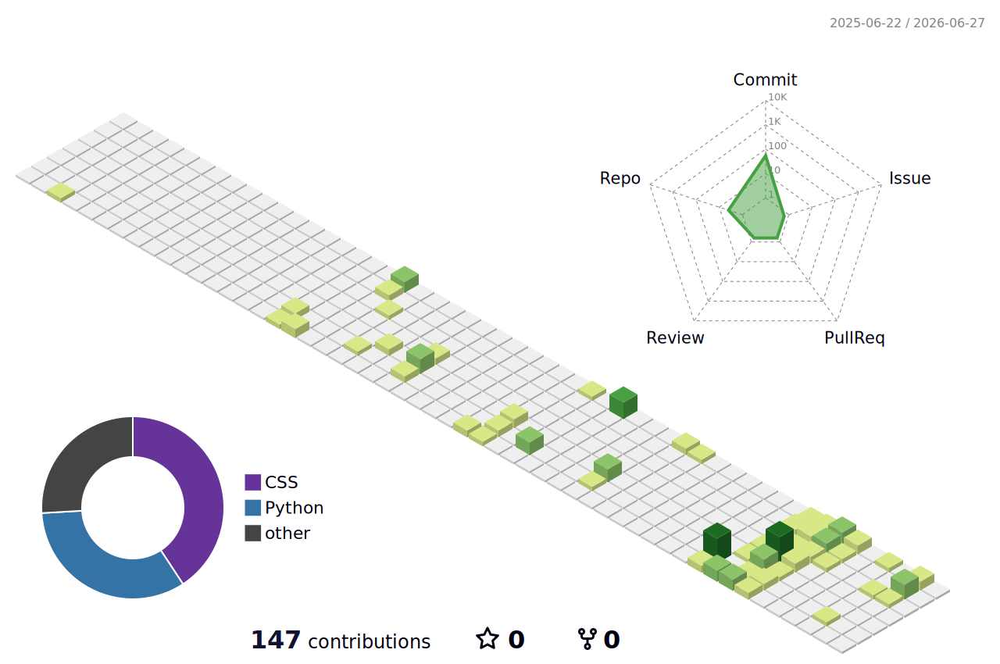

# Hi there, I'm Dongxu Liu 👋

 

---

## 🐍 Contribution Snake

<picture>
  <source media="(prefers-color-scheme: dark)" srcset="https://raw.githubusercontent.com/ldx825/ldx825/output/github-contribution-grid-snake-dark.svg">
  <source media="(prefers-color-scheme: light)" srcset="https://raw.githubusercontent.com/ldx825/ldx825/output/github-contribution-grid-snake.svg">
  
</picture>

---

## 👋 About Me

I am an undergraduate student at the **School of Artificial Intelligence, Jilin University**.

My interests include **machine learning**, **spiking neural networks**, **large language models (LLMs)**, and **multimodal large language models (MLLMs)**.

---

## 🎓 Education

**Jilin University**  
School of Artificial Intelligence  
Undergraduate Student, 2024 – Present

---

## 🔬 Research

I have participated in several research projects related to:

- Sparse AUC maximization
- Zeroth-order and first-order stochastic optimization
- Spiking neural networks
- ANN-to-SNN conversion
- Efficient large language models
- Nonsmooth minimax optimization

Some of my recent works have been submitted to or accepted at conferences including **AAAI 2026**, **AISTATS 2026**, **CVPR 2026**, and **ICML 2026**.

---

## 🚀 Projects

### Neuromorphic LLM Deployment

I am working on deploying spiking large language models on neuromorphic hardware, focusing on model spiking, operator mapping, on-chip inference, and algorithm-hardware co-design.

### Machine Learning from Scratch

I have implemented several classical machine learning algorithms from scratch, including k-NN, Naive Bayes, Decision Tree, Logistic Regression, SVM, Random Forest, AdaBoost, k-means, PCA, SVD, Apriori, and FP-growth.

### Course & Practice

I have also worked on projects involving spiking neural networks on event-camera datasets, evolutionary algorithms for TSP, and C/C++ game development.

---

## 🛠️ Skills

- Python / C / C++
- Machine Learning
- Spiking Neural Networks
- Large Language Models
- Multimodal Large Language Models

---

## 📊 GitHub Analytics

<table>
  <tr>
    <td>
      
    </td>
    <td>
      
    </td>
  </tr>
</table>

 

---

## 🧩 3D Contribution Graph

---

## 🌱 Life

I am self-driven and interested in both theoretical research and practical AI methods.  
I hope to work on meaningful AI problems that are technically challenging and useful in real-world scenarios.

Outside research, I enjoy **basketball**, **table tennis**, and **cycling**.

---

## 📫 Contact

- Email: **liudx9924@mails.jlu.edu.cn**
- GitHub: **[@ldx825](https://github.com/ldx825)**
- Homepage: **[Personal Homepage](https://ldx825.github.io/liudongxu825.github.io/)**
- Google Scholar: **[Paper List](https://scholar.google.com/citations?user=053eRGQAAAAJ&hl=en)**
